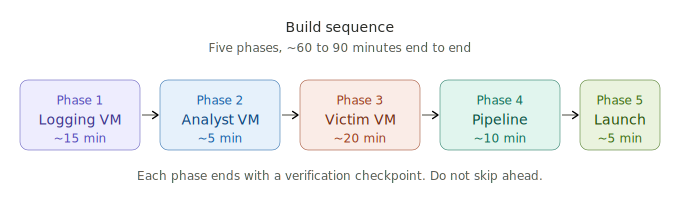
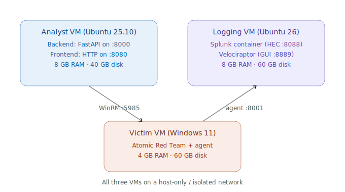

# Blue Team Trainer — Build Guide

<p align="center">
  
</p>

This guide walks you through a fresh build from zero to a working lab. **Follow the steps in order** — each phase produces something the next phase depends on.

---

## Architecture

<p align="center">
  
</p>

The Analyst and Logging VMs can be the same machine if your hardware allows.

---

## Prerequisites

Download these ahead of time:

- **Windows 11 Enterprise** (evaluation): https://www.microsoft.com/en-us/evalcenter/evaluate-windows-11-enterprise
- **Ubuntu 26 & 25.10 Desktop**: https://ubuntu.com/download/desktop
- **This repository** — clone or download as zip

Provision the VMs:

| VM | OS | RAM | Disk |
|---|---|---|---|
| Victim | Windows 11 Enterprise | 4 GB | 60 GB |
| Analyst | Ubuntu 25.10 Desktop | 8 GB | 40 GB |
| Logging | Ubuntu 26 Desktop | 8 GB | 60 GB |

All three on a host-only or isolated network. All VM's need **temporary internet access** during setup; you will disconnect them later.

---

# Phase 1 — Logging VM

This VM runs Splunk and Velociraptor. Build it first; the other VMs reference its IP.

## 1.1 Remove conflicting Docker packages

```bash
sudo apt remove $(dpkg --get-selections docker.io docker-compose docker-compose-v2 docker-doc podman-docker containerd runc | cut -f1)
```

## 1.2 Set up Docker's apt repository

```bash
sudo apt update
sudo apt install -y ca-certificates curl
sudo install -m 0755 -d /etc/apt/keyrings
sudo curl -fsSL https://download.docker.com/linux/ubuntu/gpg -o /etc/apt/keyrings/docker.asc
sudo chmod a+r /etc/apt/keyrings/docker.asc

sudo tee /etc/apt/sources.list.d/docker.sources <<EOF
Types: deb
URIs: https://download.docker.com/linux/ubuntu
Suites: $(. /etc/os-release && echo "${UBUNTU_CODENAME:-$VERSION_CODENAME}")
Components: stable
Architectures: $(dpkg --print-architecture)
Signed-By: /etc/apt/keyrings/docker.asc
EOF

sudo apt update
```

## 1.3 Install Docker

```bash
sudo apt install -y docker-ce docker-ce-cli containerd.io docker-buildx-plugin docker-compose-plugin
```

## 1.4 Verify Docker is running

```bash
sudo systemctl status docker
sudo docker run hello-world
```

You should see "Hello from Docker!" output. If you do, Docker is ready.

## 1.5 Clone the repo and edit container passwords

```bash
sudo git clone https://github.com/Incogn1toBro/BlueTeam-Trainer
cd ./BlueTeam-Trainer/setup
sudo nano docker-compose.yml
```

Search for `ChangeMe_StrongPass123!` (it appears twice, once for Splunk, once for Velociraptor) and replace with strong passwords. **Note both passwords down** — you'll need them in the next steps.

## 1.6 Bring up the containers

```bash
sudo docker compose up -d
sudo docker ps
```

You should see two containers: `bttrainer-splunk` and `bttrainer-velociraptor`. Splunk takes 2–3 minutes to fully initialise. Wait for both to show as `(healthy)` before continuing.

## 1.7 Set a static IP for the Logging VM

In the Ubuntu UI: **Settings → Network → ⚙ (cog wheel) → IPv4 → Manual**. Set an IP on your isolated network and apply.

Verify:

```bash
ip -4 addr show
```

**Write this IP down — call it `<LOGGING_VM_IP>`.** You'll use it in every other phase.

## 1.8 Configure Velociraptor — generate the agent MSI

Open `https://<LOGGING_VM_IP>:8889` in a browser. Accept the self-signed cert warning. Log in with `admin` and the password you set.

1. Click **Server Artifacts** in the left sidebar
2. Click **New Collection**
3. Search for and select `Server.Utils.CreateMSI`
4. Click **Launch** at the bottom of the dialog
5. Wait for it to complete (green tick)
6. Click into the run, then the **Uploaded Files** tab to confirm the MSI file exists.

## 1.9 Configure Splunk — index, HEC, token

Open `http://<LOGGING_VM_IP>:8100`. Log in with `admin` and the password you set.

**Create the index:**

- **Settings → Indexes → New Index**
- Name: `velociraptor`
- Save

**Configure HEC globally:**

- **Settings → Data Inputs → HTTP Event Collector → Global Settings**
- All Tokens: **Enabled**
- Default Source Type: `_json`
- Default Index: `velociraptor`
- HTTP Port Number: `8088
- SSL: Disabled
- Save

**Create the HEC token:**

- **Settings → Data Inputs → HTTP Event Collector → New Token**
- Name: `velociraptor`
- Source name override: `velociraptor`
- Description: `Velociraptor artifact uploads`
- Click **Next**
- Source type: `_json`
- Allowed indexes: `velociraptor`
- Default Index: `velociraptor`
- Click **Review** → **Submit**

**Copy the token value that appears on the next screen.** Call this `<HEC_TOKEN>`.

## 1.10 Verify HEC end-to-end

From any shell with curl:

```bash
curl -k http://<LOGGING_VM_IP>:8088/services/collector/event \
  -H "Authorization: Splunk <HEC_TOKEN>" \
  -d '{"event": "hec test from build guide"}'
```

You should see `{"text":"Success","code":0}`.

> ⚠️ **Do not move on until the curl test succeeds.** Every other phase depends on HEC working.

## 1.11 Apply the Splunk config files for VQL ingestion

Velociraptor data needs custom Splunk ingestion config so each artifact gets its own sourcetype and the right timestamps are extracted.

```bash
sudo docker exec -it bttrainer-splunk bash
```
Change into the Splunk Local System directory.

```bash
cd $SPLUNK_HOME/etc/system/local
```

Create `props.conf` (copy from `setup/splunk/props.conf` in the repo):

```bash
sudo vi props.conf
```

Paste in:

```
[vql]
INDEXED_EXTRACTIONS = json
DATETIME_CONFIG = CURRENT
TZ = GMT
category = Custom
pulldown_type = 1
TRANSFORMS-vql-sourcetype = vql-sourcetype,vql-timestamp
TRUNCATE = 512000
```

Save and exit.

Create `transforms.conf` (copy from `setup/splunk/transforms.conf` in the repo):

```bash
sudo vi transforms.conf
```

Paste in:

```
[vql-sourcetype]
INGEST_EVAL = sourcetype=lower(src_artifact)

[vql-timestamp]
INGEST_EVAL = _time=case( \
              src_artifact="artifact_Linux_Search_FileFinder",strptime(CTime,"%Y-%m-%dT%H:%M:%SZ"), \
              src_artifact="artifact_System_VFS_ListDirectory",strptime(ctime,"%Y-%m-%dT%H:%M:%S.%NZ"), \
              src_artifact="artifact_Windows_Timeline_MFT",strptime(event_time,"%Y-%m-%dT%H:%M:%S.%NZ"), \
              src_artifact="artifact_Windows_NTFS_MFT",strptime(Created0x10,"%Y-%m-%dT%H:%M:%S.%NZ"), \
              src_artifact="artifact_Windows_EventLogs_Evtx",strptime(TimeCreated,"%Y-%m-%dT%H:%M:%SZ"), \
              src_artifact="artifact_Custom_Windows_EventLogs_System_7045",strptime(TimeCreated,"%Y-%m-%dT%H:%M:%SZ"), \
              src_artifact="artifact_Windows_EventLogs_RDPAuth",strptime(EventTime,"%Y-%m-%dT%H:%M:%SZ"), \
              src_artifact="artifact_Windows_Analysis_EvidenceOfExecution_UserAssist",strptime(LastExecution,"%Y-%m-%dT%H:%M:%SZ"), \
              src_artifact="artifact_Windows_Analysis_EvidenceOfExecution_Amcache",strptime(KeyMTime,"%Y-%m-%dT%H:%M:%SZ"), \
              src_artifact="artifact_Windows_System_Amcache_InventoryApplicationFile",strptime(LastModified,"%Y-%m-%dT%H:%M:%SZ"), \
              src_artifact="artifact_Windows_Search_FileFinder",strptime(CTime,"%Y-%m-%dT%H:%M:%S.%NZ"), \
              src_artifact="artifact_Windows_Applications_NirsoftBrowserViewer",strptime(Visited,"%Y-%m-%dT%H:%M:%SZ"), \
              src_artifact="artifact_Windows_Registry_RecentDocs",strptime(LastWriteTime,"%Y-%m-%dT%H:%M:%SZ"), \
              src_artifact="artifact_Windows_Forensics_UserAccessLogs_Clients",strptime(InsertDate,"%Y-%m-%dT%H:%M:%SZ"), \
              src_artifact="artifact_Windows_Forensics_UserAccessLogs_DNS",strptime(LastSeen,"%Y-%m-%dT%H:%M:%SZ"), \
              src_artifact="artifact_Windows_Forensics_UserAccessLogs_SystemIdentity",strptime(CreationTime,"%Y-%m-%dT%H:%M:%SZ"), \
              src_artifact="artifact_Custom_Windows_Application_IIS_IISLogs",strptime(event_time,"%Y-%m-%dT%H:%M:%SZ"), \
              src_artifact="artifact_MacOS_Applications_Chrome_History",strptime(last_visit_time,"%Y-%m-%dT%H:%M:%SZ"), \
              src_artifact="artifact_Windows_Registry_UserAssist",strptime(LastExecution,"%Y-%m-%dT%H:%M:%SZ") \
              )
```

Exit the container:

```bash
exit
```
## 1.12 Revoke internet access

Revoke the virtual machine's internet access so it is only utilising the static host-only IP set during **1.7 Set a static IP for the Logging VM**

## 1.13 Restart Splunk to pick up the config

```bash
cd ./BlueTeam-Trainer/setup
sudo docker compose down
sudo docker compose up -d
sudo docker ps
```

Wait for both containers to be healthy again.

✅ **Phase 1 complete.** Logging stack is live, HEC is verified and VQL ingestion is configured.

---

# Phase 2 — Analyst VM

This is where the Blue Team Trainer frontend and backend run.

## 2.1 Clone the repo

```bash
sudo git clone https://github.com/Incogn1toBro/BlueTeam-Trainer
cd ./BlueTeam-Trainer
sudo chmod +x *.sh
```

## 2.2 Run the one-shot Ubuntu setup

```bash
sudo ./setup-ubuntu.sh
```

The script:
- Installs system dependencies (`python3-venv`, `python3-pip`, `curl`, `tmux`)
- Creates a Python venv at `backend/.venv` and installs FastAPI + pywinrm
- Downloads React + Babel JS files into `./vendor/`
- Copies `backend/.env.example` to `backend/.env`

Say yes when it offers to apt-install missing packages. Takes about 2 minutes.

## 2.3 Edit the backend config

```bash
sudo nano ./backend/.env
```

Set:

```
VICTIM_HOST=<your-victim-vm-ip>
VICTIM_USER=atomicuser
VICTIM_PASS=<the password you'll set in Phase 3>
```

You don't have the Victim VM yet — that's Phase 3. Use planned values; you can update the .env file if anything changes.

## 2.4 Revoke internet access

Revoke the virtual machine's internet access so it is only utilising its host-only IP address

> ⚠️ **Don't launch the platform yet.** Continue to Phase 3 first.

✅ **Phase 2 complete.** Analyst VM is ready, waiting on the Victim.

---

# Phase 3 — Victim VM

This is where atomic tests detonate.

## 3.1 Configure the network

In Windows: **Settings → Network & Internet → Ethernet**

- **Network Profile Type**: Private
- Click **Edit** next to the IP section
- **IP Assignment**: Manual
- Set an IP on your isolated network

**Note this IP — call it `<VICTIM_IP>`.** Update `backend/.env` on the Analyst VM if it differs from what you guessed.

Make sure the Victim still has temporary internet access at this stage (the setup script downloads PowerShell modules).

## 3.2 Disable Tamper Protection (manual GUI step — CRITICAL)

Microsoft does not allow scripted Tamper Protection disable. You **must** do this in the GUI before running the setup script.

1. Open **Windows Security** (search in Start menu)
2. **Virus & threat protection**
3. **Manage settings** under "Virus & threat protection settings"
4. Toggle **Tamper Protection** to **Off**

If this isn't off, atomics that drop tools to disk (Mimikatz, ProcDump, Rubeus) will be quarantined regardless of what the script does.

## 3.3 Clone the repo on the Victim

```powershell
Invoke-WebRequest 'https://github.com/Incogn1toBro/BlueTeam-Trainer/archive/refs/heads/main.zip' -OutFile './BlueTeam-Trainer.zip'
Expand-Archive './BlueTeam-Trainer.zip' './'
Rename-Item './BlueTeam-Trainer-main' './BlueTeam-Trainer'
Remove-Item './BlueTeam-Trainer.zip'
cd ./BlueTeam-Trainer\setup
```

## 3.4 Run the Victim setup script

In an **elevated PowerShell**:

```powershell
Set-ExecutionPolicy -ExecutionPolicy RemoteSigned -Scope LocalMachine -Force
.\victim-setup.ps1 -AtomicUserPassword '<VICTIM_PASS>' -DisableDefender
```

> The password you pass here **must match `VICTIM_PASS`** in `backend/.env` on the Analyst VM.

The script does:
1. Sets execution policy to RemoteSigned
2. Enables WinRM on TCP 5985
3. Creates the `atomicuser` local admin account
4. Disables Defender (verifies and warns if Tamper Protection blocked it)
5. Installs `Invoke-AtomicRedTeam` from PSGallery
6. Installs the atomics folder (`C:\AtomicRedTeam\atomics`)
7. Verifies the module loads cleanly
8. Enables PowerShell script block + module logging
9. Enables Process Creation auditing with command line (4688)

Takes about 3 minutes. Read the output: each step prints `[OK]` or `[!!]`.

## 3.5 Add the velociraptor host entry

The Velociraptor agent connects to a host called `velociraptor`. We need to point that to the Logging VM.

1. Open **Notepad as Administrator**
2. **File → Open → `C:\Windows\System32\drivers\etc\hosts`**
3. Add a line:

```
<LOGGING_VM_IP>    velociraptor
```

For example: `192.168.244.10    velociraptor`

4. Save

## 3.6 Install the Velociraptor agent

Open `https://<LOGGING_VM_IP>:8889` in a browser. Accept the self-signed cert warning. Log in with `admin` and the password you set.

1. Click **Server Artifacts** in the left sidebar
2. Download the MSI file 
3. Locate the `Server.Utils.CreateMSI` job previously run
4. Click into the run, then the **Uploaded Files** tab before downloading the MSI file.
5. Once the MSI file is downloaded, execute it on the Victim VM. 

To confirm the existence of the Velociraptor service run
```powershell
Get-Service Velociraptor
```

The service should be `Running`.

In the Velociraptor GUI on the Logging VM (**Clients** tab), the Victim should appear within ~30 seconds.

## 3.7 Pre-stage atomic prerequisites (offline-prep)

While the Victim still has internet, download all common payloads so the platform can run them later when isolated:

```powershell
Import-Module Invoke-AtomicRedTeam -Force

Invoke-AtomicTest T1003.001 -GetPrereqs -PathToAtomicsFolder C:\AtomicRedTeam\atomics
Invoke-AtomicTest T1558.003 -GetPrereqs -PathToAtomicsFolder C:\AtomicRedTeam\atomics
Invoke-AtomicTest T1055.001 -GetPrereqs -PathToAtomicsFolder C:\AtomicRedTeam\atomics
Invoke-AtomicTest T1059.001 -GetPrereqs -PathToAtomicsFolder C:\AtomicRedTeam\atomics
```

This downloads ProcDump, Mimikatz, Rubeus, and similar tools to `C:\AtomicRedTeam\ExternalPayloads`. After this, those tests will work even with no internet.

## 3.8 Take a snapshot of the Victim VM

In your hypervisor, snapshot the Victim **now**. Call it something like `clean-baseline`. This is your training baseline, revert here after execution of payloads.

✅ **Phase 3 complete.** Victim is ready and snapshotted.

---

# Phase 4 — Velociraptor → Splunk Pipeline

This wires up the data pipeline so artifacts you collect in Velociraptor land in Splunk for hunting.

## 4.1 Configure Splunk.Flows.Upload

Open Velociraptor (`https://<LOGGING_VM_IP>:8889`).

1. **Server Events** in the left sidebar
2. Click **Update Server Monitoring Table** (top right)
3. Add **`Splunk.Flows.Upload`** to the list of monitored artifacts
4. Click **Configure Parameters** at the top
5. Click the spanner icon next to `Splunk.Flows.Upload`
6. Fill in:
   - **URL**: `http://<LOGGING_VM_IP>:8088/services/collector/event`
   - **token**: `<HEC_TOKEN>` from Phase 1.9
   - **index**: `velociraptor`
   - **SkipVerify**: enabled (SSL disabled for HEC in this lab)
7. Click **Launch**

From now on, every collection you run in Velociraptor automatically forwards to Splunk.

## 4.2 Test the pipeline

In Velociraptor:

1. **Clients** → click your Victim
2. **Collected** tab → **New Collection**
3. Search for and add `Windows.System.Pslist`
4. Click **Launch**
5. Wait for the state to show a green tick (Completed)

In Splunk, search:

```
index=velociraptor
```

You should see process listing data flowing in. **Do not move on until you see this.**

## 4.3 Snapshot the Logging VM

Once the pipeline is verified working, snapshot the Logging VM. Saves you re-doing all this Splunk + Velociraptor config if you need to start fresh.

✅ **Phase 4 complete.** Pipeline is wired and tested.

---

# Phase 5 — Launch the Platform

Back on the Analyst VM:

```bash
cd ~/BlueTeam-Trainer
./run-all.sh
```

A tmux session opens with two panes — backend on top, frontend on the bottom. Your browser opens to `http://localhost:8080/blueteam-trainer.html`.

## 5.1 Verify the backend API can reach the Victim

In Firefox: `http://localhost:8000/health`

You should see:

```json
{
  "status": "healthy",
  "victim_reachable": true,
  ...
}
```

If `victim_reachable: false`, check `backend/.env` settings and that WinRM is reachable: `nc -zv <VICTIM_IP> 5985`.

## 5.2 Switch to Live Mode

In the trainer UI:

1. Click **⚙ Settings** (top right)
2. Confirm API base is `http://localhost:8000`
3. Toggle **Mock Mode → Live Mode**

## 5.3 Snapshot the Analyst VM

You're at a known-good state. Snapshot.

## 5.4 First run — pick a technique and detonate

1. Browse to **T1082** (System Information Discovery — marked **○ OFFLINE**)
2. Click into it → **⚡ Detonate** on the first atomic test
3. Watch the **Session Log** tab — should show ✓ SUCCESS within seconds

Now hunt for it:

1. In Velociraptor, **Clients** → Victim → **Collected** → **New Collection**
2. Add `Windows.System.Pslist` (or another relevant artifact for the technique)
3. Launch
4. In Splunk: `index=velociraptor` — find the evidence

That's the full loop: **detonate → collect → hunt**.

✅ **Build complete.**

---

# Common pitfalls

| Symptom | Cause | Fix |
|---|---|---|
| Tests detonate but Defender quarantines | Tamper Protection still on | Phase 3.2 — toggle off in Defender GUI, re-run script |
| Backend reports `victim_reachable: false` | WinRM unreachable | `nc -zv <VICTIM_IP> 5985` — check firewall and WinRM service |
| Velociraptor agent never appears | Hosts file or port wrong | Phase 3.5 — confirm `velociraptor` resolves; agent connects on 8001 |
| `Invoke-AtomicTest` not recognised | Module not in PSModulePath | Run `setup/fix-atomic-install.ps1` on the Victim |
| Atomic test reports SUCCESS but actually failed | Internet-dependent test | Look for **● ONLINE** badge — these need internet to work |

When all else fails, run `python backend/diagnose.py` from the Analyst VM. It walks through 6 checks and tells you exactly what's broken.

---

# Routine use after this build

Just three things to remember:

1. **Start the platform**: `./run-all.sh` on the Analyst VM
2. **Revert the Victim** snapshot after every detonation to keep a clean baseline
3. **Detach from tmux** with `Ctrl+B D` — re-attach with `tmux attach -t bttrainer`

That is it. Have fun training.
