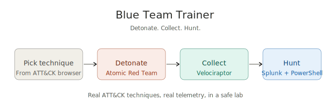

# Blue Team Trainer

<p align="center">
  
</p>

> A self-contained training platform for host countermeasure analysts to build fluency in **Splunk**, **Velociraptor** and **PowerShell** by detonating real ATT&CK techniques and hunting them with real tools.
---

## Architecture

<p align="center">
  
</p>

---

## What's in the box

- **Web UI** — browse 19 ATT&CK techniques across 12 tactics, detonate atomic tests, build attack chains and see real-time results
- **FastAPI backend** — orchestrates Atomic Red Team execution on the Victim VM via WinRM
- **Splunk + Velociraptor stack** — Docker Compose for the logging side, with HEC pre-configured for VQL ingestion
- **Hunt packs** — SPL queries, VQL artifacts and PowerShell commands for each technique
- **Scenario builder** — chain techniques together to simulate full attack paths (Phishing → Persistence → Credential Access → Lateral Movement)
- **Diagnostic tools** — `diagnose.py` walks through 6 progressive health checks; `fix-atomic-install.ps1` repairs broken Atomic installs

---

## Get started

**👉 Read [BUILD.md](BUILD.md) for the full step-by-step guide.**

It walks you through five phases with verification at each step:

1. **Logging VM** — Docker, Splunk, Velociraptor, HEC config (~15 min)
2. **Analyst VM** — Backend + frontend setup on Ubuntu (~5 min)
3. **Victim VM** — Windows preparation, Atomic Red Team install, agent deployment (~20 min)
4. **Pipeline wiring** — Velociraptor → Splunk via HEC (~10 min)
5. **Launch** — verify everything works end-to-end (~5 min)

End-to-end build time: 60–90 minutes the first time.

---

## Repository layout

```
blueteam-trainer/
├── BUILD.md                          ← Start here. Full build guide.
├── README.md                         ← This file
│
├── blueteam-trainer.html             ← The frontend (single-file HTML build)
├── blueteam-trainer.jsx              ← Frontend source for customisation
│
├── setup-ubuntu.sh                   ← Ubuntu Analyst VM one-shot setup
├── run-all.sh                        ← Combined backend + frontend launcher (tmux)
├── fetch-vendor.{sh,ps1}             ← Download React/Babel for offline use
├── start-trainer.{sh,ps1}            ← Frontend-only launcher (alternative)
│
├── backend/
│   ├── main.py                       ← FastAPI orchestrator
│   ├── atomic_runner.py              ← WinRM + Atomic execution
│   ├── diagnose.py                   ← 6-step Victim health check
│   ├── requirements.txt
│   └── .env.example
│
├── setup/
│   ├── docker-compose.yml            ← Splunk + Velociraptor containers
│   ├── victim-setup.ps1              ← Windows VM preparation
│   ├── fix-atomic-install.ps1        ← Atomic install repair script
│   ├── velociraptor-splunk-pipeline.md  ← HEC pipeline reference
│   └── splunk/
│       ├── props.conf                ← VQL ingestion config
│       └── transforms.conf           ← VQL artifact timestamp extraction
│
├── docs/
│   └── REFERENCE.md                  ← Detailed reference + troubleshooting
│
└── vite-project/                     ← Alternative Node.js-based frontend build
```

---

## Quick orientation

If you want to know more before diving into the build:

- **What the platform actually does** during a detonation: see the architecture diagram in [BUILD.md](BUILD.md)
- **Why this design over a vanilla Atomic Red Team install**: see [docs/REFERENCE.md](docs/REFERENCE.md) — the platform adds analyst-facing UI, hunt packs, scenario chaining and a session log so it works as training rather than just red-team automation
- **What "connectivity badges" mean** (○ OFFLINE / ◐ STAGED / ● ONLINE): see [docs/REFERENCE.md](docs/REFERENCE.md) section "Network access and the connectivity badges"
- **Why Sysmon and the Splunk Universal Forwarder are deliberately not installed**: see [docs/REFERENCE.md](docs/REFERENCE.md) — short version: most enterprise endpoints do not have either, thus, the training is more realistic without them

---

## Status

This is a working lab. Tested on:

- **Logging VM**: Ubuntu 26 Desktop with Docker CE
- **Analyst VM**: Ubuntu 25.10 Desktop
- **Victim VM**: Windows 11 Enterprise (evaluation)

Pull requests welcome — particularly more techniques, hunt packs or scenario templates.

---

## Important notes

🔒 **Lab use only.** This setup intentionally weakens security on the Victim VM (disables Defender, enables unencrypted WinRM, installs offensive tooling). Run it only on isolated VMs, never on production or anything network-adjacent to it.

📸 **Snapshot regularly.** Atomic tests leave residual artifacts (registry keys, scheduled tasks, services). Revert the Victim after every detonation to keep a clean baseline.

🧠 **The friction is the feature.** Velociraptor collections are deliberately not automated — analysts choose what to collect. That is the training value.

---

## Credits

This platform wraps and orchestrates several great open-source projects:

- [Atomic Red Team](https://github.com/redcanaryco/atomic-red-team) — Red Canary
- [Invoke-AtomicRedTeam](https://github.com/redcanaryco/invoke-atomicredteam) — Red Canary
- [Velociraptor](https://github.com/Velocidex/velociraptor) — Velocidex
- [Splunk](https://www.splunk.com) — Splunk Inc (trial licence)

The glue (frontend, backend, setup scripts, build guide) is yours to fork, modify, and use freely under the [MIT License](LICENSE).
