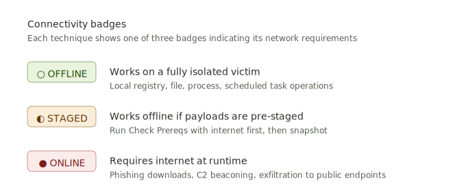

# Blue Team Trainer

A self-contained training platform for host countermeasure analysts to build fluency in **Splunk**, **Velociraptor** and **PowerShell** by detonating real ATT&CK techniques and hunting them with real tools.

The loop: pick a technique → detonate an Atomic Red Team test on a victim VM → hunt the artefacts with the provided SPL, VQL, and PowerShell queries.

---

## Architecture

```
┌────────────────────────────────────────────────────────────┐
│              Analyst Workstation (browser)                 │
│                                                            │
│    Blue Team Trainer UI (React artifact)                   │
│    - ATT&CK Browser                                        │
│    - Scenario Builder                                      │
│    - Session Log                                           │
└────────────────────┬───────────────────────────────────────┘
                     │ HTTP POST /detonate
                     ▼
┌────────────────────────────────────────────────────────────┐
│              FastAPI Backend (localhost:8000)              │
│    - Receives detonate requests                            │
│    - Translates to Invoke-AtomicTest calls                 │
│    - Sends via WinRM to victim                             │
└────────────────────┬───────────────────────────────────────┘
                     │ WinRM (5985)
                     ▼
┌────────────────────────────────────────────────────────────┐
│              Windows Victim VM                             │
│    - Invoke-AtomicRedTeam                                  │
│    - Native Windows logging (Security, PowerShell/Op)      │
│    - Velociraptor agent                                    │
└──────────┬─────────────────────────────────────────────────┘
           │ agent callback
           ▼
  ┌────────────────────┐         ┌──────────────────┐
  │  Velociraptor      │ ──HEC──▶│  Splunk          │
  │  Server            │         │  (index=vel...)  │
  │  (analyst runs     │         │                  │
  │  artifacts here)   │         │                  │
  └────────────────────┘         └──────────────────┘
```

Everything except the victim VM runs as Docker containers or local processes. The analyst workstation can be the same box as the Splunk/Velociraptor stack, or separate.

---

## Contents

```
blueteam-trainer/
├── blueteam-trainer.html         # Self-contained HTML build (use this)
├── blueteam-trainer.jsx          # React source (for customisation)
├── setup-ubuntu.sh                 # Ubuntu 25.10 one-shot setup
├── run-all.sh                      # Ubuntu combined backend+frontend launcher (tmux)
├── fetch-vendor.ps1                # One-time vendor library download (Windows)
├── fetch-vendor.sh                 # One-time vendor library download (Linux/Mac)
├── start-trainer.ps1               # Frontend-only launcher (Windows)
├── start-trainer.sh                # Frontend-only launcher (Linux/Mac)
├── vendor/                         # Created by fetch-vendor (gitignored)
│   ├── react.production.min.js
│   ├── react-dom.production.min.js
│   └── babel.min.js
├── vite-project/                   # Alternative: Vite-based React build
│   ├── package.json
│   ├── vite.config.js
│   ├── index.html
│   ├── src/
│   │   ├── main.jsx
│   │   └── BlueTeamTrainer.jsx
│   └── README.md
├── backend/
│   ├── main.py                     # FastAPI app
│   ├── atomic_runner.py            # WinRM + Atomic execution logic
│   ├── requirements.txt
│   └── .env.example                # Config template
├── setup/
│   ├── victim-setup.ps1                # Windows victim VM preparation
│   ├── fix-atomic-install.ps1          # Repair Atomic install on existing victims
│   ├── velociraptor-splunk-pipeline.md # Full HEC pipeline setup guide
│   └── docker-compose.yml              # Splunk + Velociraptor stack
└── README.md
```

---

## Prerequisites

| Component | Requirements |
|---|---|
| **Victim VM** | Windows 10/11 (build 1903+), 4GB RAM, 60GB disk, isolated network segment |
| **Logging host** | Linux with Docker 24+ and Docker Compose, 8GB RAM, 40GB disk |
| **Analyst workstation** | Python 3.8+ (any modern install includes it), modern browser, ~700KB for vendor JS files |
| **Network** | Victim VM must be reachable from the backend host on TCP 5985 |

**Recommended topology:** All three on a single host's hypervisor (VirtualBox, VMware Workstation, or Proxmox) on an internal/host-only network. No internet egress from the victim except during initial setup.

---

## Quickstart

Refer to BUILD.md

#### Alternative: Vite project (no Python needed, customisable)

If your analyst laptops don't have Python, or you want to extend the frontend with hot-reload during development, use the included Vite project at `vite-project/`. See [`vite-project/README.md`](vite-project/README.md) for the full workflow. In short:

```bash
cd ./BlueTeam-Trainer/vite-project
npm install     # one-time, needs internet
npm run build   # produces dist/ - fully static, no runtime deps
```

Then ship the resulting `dist/` folder to analyst laptops. They can open `dist/index.html` directly in Firefox, or serve it via any static file server they have (IIS, nginx, `npx serve`, etc.).

Both paths render the exact same component — pick whichever fits your environment best.

---

## Usage Guide

### Typical analyst workflow

1. **Select a technique** in the ATT&CK Browser (e.g. T1003.001 - LSASS Memory Dump).
2. **Read the hunt pack** for that technique — SPL, VQL and PowerShell queries that should detect it.
3. **Detonate** one of the atomic tests. The backend runs it via WinRM.
4. **Switch to Velociraptor** and run the suggested artifacts against the victim client. Interpret the output within Splunk.
5. **Repeat on the endpoint** using the PowerShell commands for live-response-style investigation.
6. **Log observations** in the Session Log (the platform records auto, but analysts should take notes).

### Scenario chains

For more realistic training, build a chain:
- Add 4-8 techniques that map to a plausible attack path (e.g. Initial Access → Execution → Credential Access → Lateral Movement → Exfil).
- Run them in sequence.
- Analysts then have to piece together the full chain from telemetry alone - far more representative of real investigations than single technique detonations.

Three example scenarios are pre-loaded: **Ransomware Chain**, **Phishing → Persistence** and **Lateral Movement**.

### Reverting and re-running

Most atomic tests leave artefacts (registry keys, files, scheduled tasks, services). You have three options:

1. **`/cleanup`** — many atomics ship with cleanup commands. Not all do.
2. **VM snapshot revert** — cleanest. Revert between exercises.
3. **Accept drift** — if the VM has accumulated junk, it's a more realistic environment anyway.

For a training rotation, snapshot-revert between analysts is best.

### Network access and the connectivity badges

<p align="center">
  
</p>

Each technique in the ATT&CK Browser shows one of three connectivity badges:

| Badge | Meaning |
|---|---|
| **○ OFFLINE** (green) | Works on a fully network-isolated victim. Local-only operations like registry persistence, scheduled tasks, process discovery, file encryption simulators. |
| **◐ STAGED** (amber) | Will work offline if you stage the payloads first. Click **⚙ Check Prereqs** while the victim has internet — this downloads the required tools (procdump, mimikatz, rubeus, etc.) into `C:\AtomicRedTeam\ExternalPayloads`. Take a snapshot afterwards and the test works on every revert without needing internet again. |
| **● ONLINE** (red) | Requires internet at runtime — phishing downloads, C2 beaconing, exfil to public endpoints. Won't work on an isolated victim with no workaround. |

**Recommended setup workflow:**

1. Bring up the victim with **temporary internet access** (e.g. attach a NAT adapter alongside the host-only one, or temporarily route through your hypervisor's NAT)
2. In the trainer UI, filter to **◐ Staged** techniques and click **⚙ Check Prereqs** on each one. This pre-downloads all the tooling into `C:\AtomicRedTeam\ExternalPayloads`.
3. **Disconnect the victim from the internet** (remove the NAT adapter or block egress at the firewall)
4. **Take a snapshot.** This is your training baseline.
5. From now on, **○ Offline** and **◐ Staged** techniques both work without internet. **● Online** techniques will fail with a clear "DNS resolution failed" message — leave these for a separate "internet-connected day" if you want to cover them or filter them out.

This gives you the best of both worlds: realistic isolation during training, plus access to the LSASS dump / kerberoasting / mimikatz tradecraft that requires staged tooling.

### Detection of "false success"

The backend pattern-matches the test output against known failure indicators (DNS errors, connection refused, HTTP 4xx/5xx, Defender messages, access denied, etc.) even when Atomic Red Team itself reports success. If a network-dependent atomic claims to have run but the download failed, you'll see:

```
[Detected failure] DNS resolution failed - victim has no internet access
```

at the top of the STDERR pane in the Session Log. This catches the scenario where Atomic prints "ATOMIC_SUCCESS" after a failed `Invoke-WebRequest` because its final command happened to succeed.

---

## Troubleshooting

### Tests are returning "failed" — first thing to do

Run the diagnostic script. It walks through 6 checks in order, stops at the first failure with a clear remediation hint, and ends by running the simplest possible atomic test (`T1082-1` — just runs `systeminfo`):

```bash
cd ./BlueTeam-Trainer/backend
source .venv/bin/activate
python diagnose.py
```

Common outcomes and what they mean:

| Where it fails | What's wrong | Fix |
|---|---|---|
| Step 2 (WinRM) | Network or credentials | Check firewall, `.env` values, WinRM service |
| Step 4 (module) | Atomic Red Team not installed | Re-run `victim-setup.ps1` or `Install-AtomicRedTeam` manually |
| Step 5 (atomics folder) | Module installed but atomics not pulled | `Install-AtomicRedTeam -getAtomics -Force` on victim |
| Step 6 (T1082-1) | Environment is broken in some other way | Look at the stderr printed by the script |

### Seeing what *actually* failed inside the platform

When a detonation in the UI shows ✕ FAILED, click the row in the **Session Log** tab — it expands to show the raw stdout and stderr from the victim. Look for:

- `ATOMIC_PRECHECK_FAILED` — module or atomics folder missing on the victim
- `ATOMIC_TEST_EXCEPTION` — the test threw an exception (often Defender blocking, missing prereqs, or test bug)
- Defender messages (`This program is blocked by group policy`, `Operation did not complete successfully because the file contains a virus`) — Defender ate it; see below

### Specific failure modes

**Detonation succeeds but you see Defender messages in stdout** — Defender blocked it. Even with `-DisableDefender` the script cannot override Tamper Protection. On the victim:
1. Open Windows Security → Virus & threat protection → Manage settings
2. Toggle **Tamper Protection** off (requires local admin and possibly a reboot)
3. Re-run `victim-setup.ps1` or manually `Set-MpPreference -DisableRealtimeMonitoring $true`
4. Add path exclusion: `Add-MpPreference -ExclusionPath 'C:\AtomicRedTeam'`

**Test prerequisites missing** — Some atomics need files staged before they will run (e.g. T1003.001-1 needs `procdump.exe`, T1558.003-1 needs `Rubeus.exe`). Click the **⚙ Check Prereqs** button on the test card — this runs `Invoke-AtomicTest -CheckPrereqs -GetPrereqs` and downloads/installs anything missing. Then retry the detonation.

**Test still fails after prereqs OK and Defender disabled** — Read the atomic's YAML on the victim to understand what it's actually doing:
```powershell
Get-Content "C:\AtomicRedTeam\atomics\T1003.001\T1003.001.yaml"
```
Some tests assume specific environments (domain joined, certain Windows version, x64 only). The YAML's `prereq_command` and `executor` sections are the source of truth.

### Other common issues

**Backend reports `victim_reachable: false`**
- Check `/etc/hosts` / DNS - can the backend resolve the victim hostname?
- Firewall: is TCP 5985 open on the victim? `Test-NetConnection <victim> -Port 5985`
- On the victim: `Get-Service WinRM` should be `Running`
- Credentials: `VICTIM_USER` must be the atomic user, password must match. Try manually: `Enter-PSSession <victim> -Credential atomicuser`
- Transport mismatch: if you set `WINRM_PORT=5986`, WinRM must be configured for HTTPS

**Atomic test runs but nothing appears in Splunk**

The platform no longer auto-forwards logs from the victim. Logs reach Splunk only when an analyst runs a Velociraptor artifact with `Splunk.Flows.Upload` as a post-process step. If you're missing data:

- Have you actually *run* a Velociraptor artifact for what you are hunting? Detonation alone does not ship anything to Splunk anymore.
- Is the Splunk.Flows.Upload artifact configured correctly? See [`setup/velociraptor-splunk-pipeline.md`](setup/velociraptor-splunk-pipeline.md) Steps 1–4.
- Test HEC reachability: `curl -k https://<LOGGING_VM_IP>:8088/services/collector/event -H "Authorization: Splunk <token>" -d '{"event":"test"}'` should return `{"text":"Success","code":0}`
- Verify the `velociraptor` index exists in Splunk and the HEC token is allowed to write to it

**Velociraptor doesn't see the victim**
- Check the agent service `Velociraptor` is running on the victim
- Agent config must point to the correct server URL and port

**`Invoke-AtomicTest` not recognised in WinRM session / "module Invoke-AtomicRedTeam was not loaded"**

This means the module is installed in a location that isn't in `$env:PSModulePath`, so non-interactive WinRM sessions can't find it via `Get-Module -ListAvailable`. The cleanest fix is to install via the PowerShell Gallery, which places the module in the standard AllUsers folder (`$env:ProgramFiles\WindowsPowerShell\Modules`) that is already discoverable everywhere.

**Fast fix — copy `setup/fix-atomic-install.ps1` to the victim and run it:**

```powershell
# On the victim, in elevated PowerShell:
.\fix-atomic-install.ps1
```

It bootstraps NuGet, installs `invoke-atomicredteam` and `powershell-yaml` from PSGallery in AllUsers scope, ensures the atomics folder is present, verifies the module loads cleanly in a fresh session and restarts WinRM. This is the same logic the new `victim-setup.ps1` uses as its primary install path.

**Manual equivalent if you don't want to use the script:**

```powershell
# On the victim, elevated PowerShell:
[Net.ServicePointManager]::SecurityProtocol = 'Tls12'
Get-PackageProvider -Name NuGet -ForceBootstrap | Out-Null
Set-PSRepository -Name PSGallery -InstallationPolicy Trusted
Install-Module -Name invoke-atomicredteam,powershell-yaml -Scope AllUsers -Force -AllowClobber
Restart-Service WinRM

# Verify:
powershell.exe -NoProfile -Command "Get-Module -ListAvailable Invoke-AtomicRedTeam | Format-List Name, Path"
```

After this, run `python diagnose.py` from the Ubuntu backend folder — all 6 checks should pass.

**PowerShell scripts won't run on the victim ("scripts is disabled on this system")**

Set the execution policy. The current `victim-setup.ps1` does this as Step 0, but if you need to do it manually:

```powershell
Set-ExecutionPolicy -ExecutionPolicy RemoteSigned -Scope LocalMachine -Force
```

`RemoteSigned` is the recommended setting — local scripts run, downloaded scripts need a signature. `Unrestricted` works too but is less safe.

---

## Security Notes

This toolkit is **deliberately** a security-weakened environment. Before using it:

- **Network isolation.** Victim must be on an isolated network segment with no route to production, personal devices or corporate resources. Host-only or internal-only hypervisor networks work well.
- **WinRM on HTTP with basic auth is insecure.** Only acceptable on an isolated lab network. For production-adjacent training, switch to HTTPS (5986) with a self-signed cert and Kerberos/NTLM.
- **The `atomicuser` account is a local admin.** Do not use these credentials anywhere else. Never join the victim VM to a production domain.
- **Real malicious techniques are executed.** You are downloading and running real tradecraft (Mimikatz, LSASS dumpers, credential harvesters). Never on a host you care about.
- **Snapshot before, revert after.** Residual persistence mechanisms will accumulate. Treat the victim as disposable.
- **Data exfil atomics reach the internet.** Some atomics POST test data to external endpoints. Block egress from the victim to prevent unintended traffic after initial setup.

---

## Extending the Platform

### Adding more techniques

Each technique in the frontend is a JS object with:

```javascript
{
  id: 'T1234.001',
  tactic: 'TA0003',
  name: 'Technique Name',
  description: '...',
  atomicTests: [
    { id: 'T1234.001-1', name: '...', description: '...' }
  ],
  huntPack: {
    splunk: ['query 1', 'query 2'],
    vql:    ['artifact 1', 'artifact 2'],
    powershell: ['cmd 1', 'cmd 2']
  }
}
```

Add entries to the `TECHNIQUES` array in `blueteam-trainer.jsx`. The test IDs must match Atomic Red Team's test numbering (see `C:\AtomicRedTeam\atomics\<technique-id>\<technique-id>.yaml` on the victim).

### Adding new scenario templates

Modify the built-in scenarios in the frontend — search for "EXAMPLE SCENARIOS" in the JSX.

### Custom hunt queries

You can maintain hunt queries separately in your SOC's detection-as-code repo and reference them in the frontend with a note like `# See detections/t1003_lsass.spl`. The hunt pack is meant as a starting point for analyst curiosity, not a comprehensive detection library.

---

## Licence & Credits

This platform wraps and orchestrates several open-source projects. All credit to their maintainers:

- [Atomic Red Team](https://github.com/redcanaryco/atomic-red-team) — Red Canary
- [Invoke-AtomicRedTeam](https://github.com/redcanaryco/invoke-atomicredteam) — Red Canary
- [Velociraptor](https://github.com/Velocidex/velociraptor) — Velocidex
- [Splunk](https://www.splunk.com) — Splunk Inc (trial licence for lab use)

The glue code (frontend, backend, setup scripts) is yours to modify, fork and adapt freely for internal training use.
